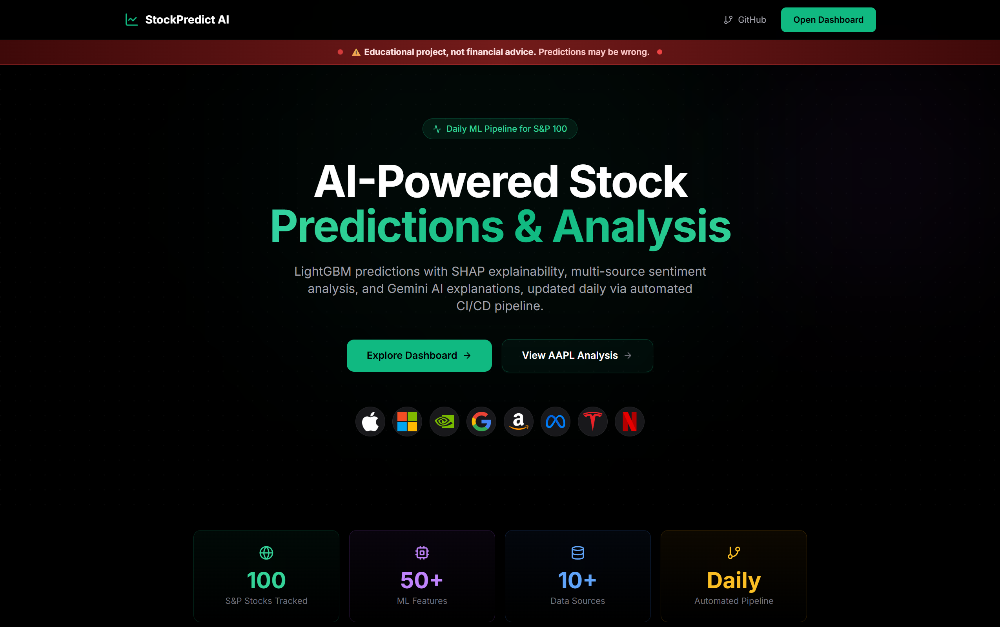
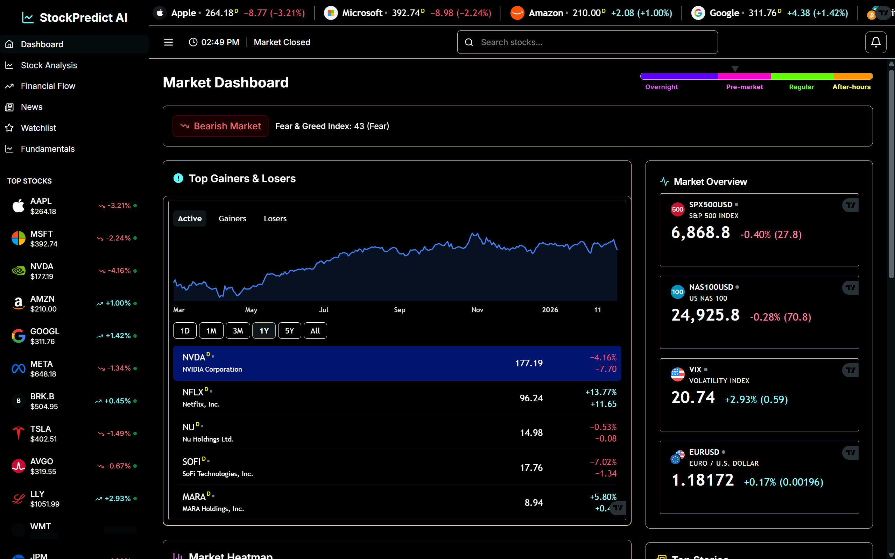
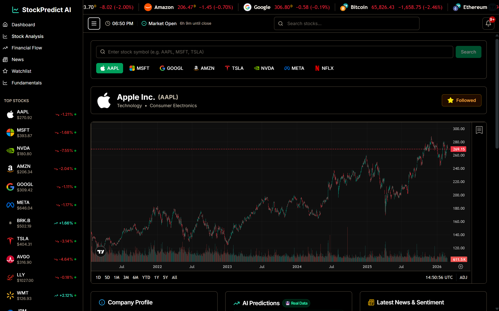

<p align="center">
  
</p>

<h1 align="center">StockPredict AI</h1>

<p align="center">
  <strong>AI-powered stock prediction platform for S&P 75 companies</strong><br/>
  LightGBM + LSTM · 113 engineered features · SHAP explanations · Groq AI insights
</p>

<p align="center">
  <a href="https://stockpredict.dev"><strong>🚀 Live Demo →</strong></a>
</p>

<p align="center">
  
  
  
  
</p>

---

## 📸 Screenshots

<p align="center">
  
  <br/><em>Landing page with AI-powered stock predictions overview</em>
</p>

<p align="center">
  
  <br/><em>Market dashboard with real-time prices, Fear & Greed Index, and top movers</em>
</p>

<p align="center">
  
  <br/><em>Detailed stock analysis with TradingView charts and AI predictions</em>
</p>

---

## ✨ Key Features

| Feature | Description |
|---------|-------------|
| 🤖 **ML Predictions** | 1-day, 7-day, 30-day forecasts with confidence scores and price ranges |
| 💬 **AI Explanations** | Plain-English insights powered by Groq AI (Llama 3.1) + SHAP analysis |
| 📊 **Real-Time Data** | Live quotes via Finnhub WebSocket + TradingView charts |
| 📰 **News Sentiment** | 10+ sources scored with FinBERT, RoBERTa, and VADER |
| 📈 **Technical Analysis** | RSI, MACD, Bollinger Bands, moving averages |
| 💰 **Sankey Diagrams** | Interactive revenue → expense → profit flow visualizations |
| 👀 **Watchlist** | Track stocks with real-time updates and alerts |

---

## 🏗️ Architecture

```
┌─────────────────────────────────────────────────────┐
│              Frontend (Next.js 15)                   │
│         Vercel · TradingView · ECharts              │
└────────────────────────┬────────────────────────────┘
                         │ Vercel rewrites /api/* →
┌────────────────────────▼────────────────────────────┐
│            Node.js Backend (Express)                 │
│     Koyeb · API Gateway · Finnhub WebSocket         │
└────────────────────────┬────────────────────────────┘
                         │ Reads stored predictions
┌────────────────────────▼────────────────────────────┐
│               MongoDB Atlas (M0 Free)                │
│      Predictions · Sentiment · Historical Data       │
└────────────────────────┬────────────────────────────┘
                         │ Written daily by
┌────────────────────────▼────────────────────────────┐
│          ML Pipeline (Python · GitHub Actions)       │
│   LightGBM · LSTM · SHAP · Groq AI · Sentiment      │
└─────────────────────────────────────────────────────┘
```

> **Important**: The ML pipeline does **not** run as a live server in production. It runs exclusively as a **daily GitHub Actions workflow** that trains models, generates predictions, and writes results to MongoDB. The Node.js backend then reads those pre-computed results and serves them to users.

---

## 🧠 How Predictions Work

1. **Data Collection** — Fetch OHLCV, sentiment from 10+ sources, macro indicators, insider trades
2. **Feature Engineering** — Build ~77 base features (+ LSTM embeddings → ~113 total)
3. **Model Training** — LightGBM with LSTM temporal embeddings, walk-forward validation
4. **Prediction** — Cross-sectional ranking selects top quintile stocks
5. **Explanation** — SHAP decomposes prediction; Groq AI writes human-readable insight

### Latest Backtest Results (Sep 2025 — Mar 2026)

| Horizon | Return | Sharpe | Win Rate |
|---------|--------|--------|----------|
| **30-day** | +13.71% | 2.68 | 64.3% |
| **7-day** | +8.05% | 1.61 | 50.4% |

---

## 🛠️ Tech Stack

| Layer | Technologies |
|-------|-------------|
| **Frontend** | Next.js 15, React 18, TypeScript, Tailwind, Shadcn/UI, TradingView |
| **Backend** | Node.js, Express, MongoDB |
| **ML/AI** | LightGBM, PyTorch (LSTM), SHAP, Groq (Llama 3.1), FinBERT |
| **Infrastructure** | Vercel, Koyeb, GitHub Actions, MongoDB Atlas |

---

## ⚡ Daily Pipeline

Runs automatically via GitHub Actions after market close (~2 hours total):

1. **Sentiment** — Fetch & score news from 10+ sources
2. **Training** — Engineer features, train LightGBM + LSTM
3. **Predictions** — Generate forecasts for all 75 tickers
4. **Verification** — Assert canary tickers have fresh predictions
5. **Explanations** — SHAP analysis + Groq AI writing
6. **Evaluation** — Compare past predictions vs actual outcomes
7. **Drift Monitoring** — Check for prediction distribution shifts

> The pipeline includes **quality gates** that fail the job if <80% of predictions succeed or >20% of data fetches fail. Thresholds are configurable via environment variables.

---

## 💸 Cost: $0/month

Runs entirely on free tiers:
- **Vercel** (frontend hosting)
- **Koyeb** (Node.js backend, scale-to-zero)
- **MongoDB Atlas** (M0 free cluster, 512MB)
- **Groq** (14.4K requests/day free — primary AI explainer)
- **GitHub Actions** (2,000 min/month free)

---

## 📚 Documentation

For detailed technical documentation, see **[DOCUMENTATION.md](DOCUMENTATION.md)** (2,600+ lines covering architecture, APIs, schemas, and pipeline details).

---

## License

This project is licensed under the [**GNU Affero General Public License v3.0 (AGPL-3.0)**](LICENSE).

If you deploy this software as a network service, you must make the complete source code available to users of that service under the same license.

---

<p align="center">
  Built by <a href="https://github.com/Yogesh-VG0">Yogesh Vadivel</a>
</p>
